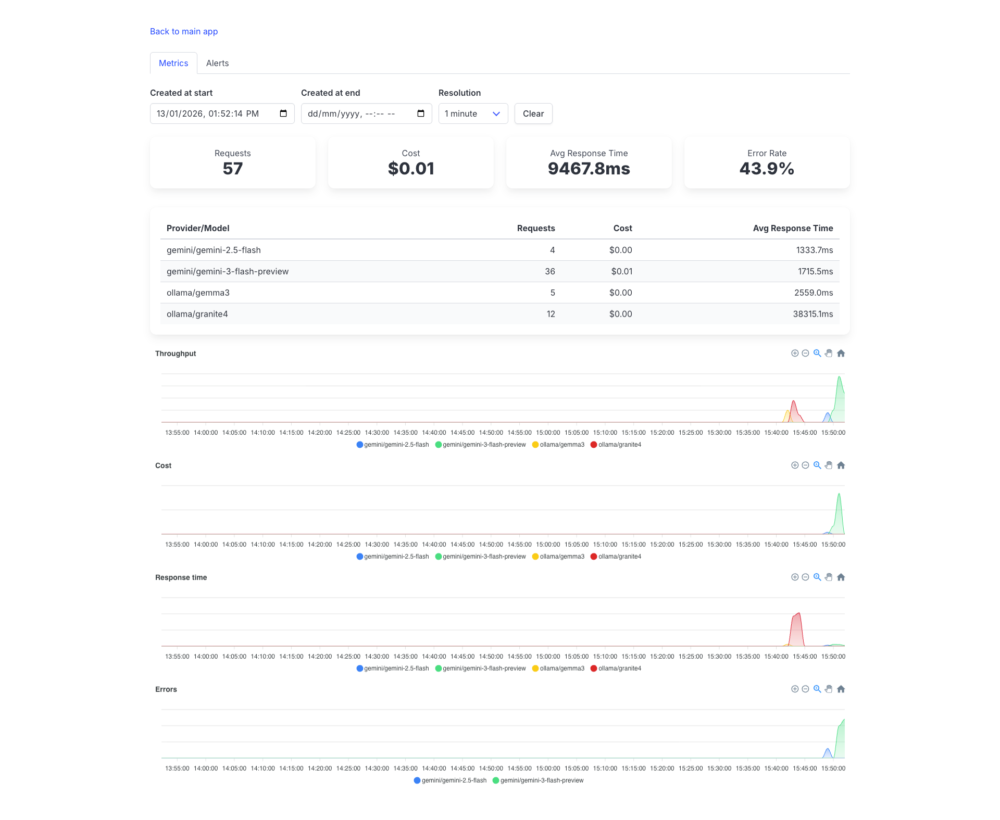

# RubyLLM::Monitoring

Monitor your LLM usage within your Rails application.

## Installation

> [!NOTE]
> This engine relies on [RubyLLM](https://github.com/crmne/ruby_llm). Make sure you have it installed and configured.

Add this line to your application's Gemfile:

```ruby
gem "ruby_llm-monitoring"
```

And then execute:

```bash
$ bundle
```

To copy and migrate RubyLLM::Monitoring's migrations, run:

```
$ rails ruby_llm_monitoring:install:migrations db:migrate
```

And then mount the engine in your `config/routes.rb`:

```ruby
Rails.application.routes.draw do
  # ...

  mount RubyLLM::Monitoring::Engine, at: "/monitoring"
end
```

Now you should be able to browse to `/monitoring` and monitor your LLM usage.



### Authentication and authorization

RubyLLM::Monitoring leaves authentication and authorization to the user. If no authentication is enforced, `/monitoring` will be available to everyone.

To enforce authentication, you can use route [constraints](https://guides.rubyonrails.org/routing.html#advanced-constraints), or set up a HTTP Basic auth middleware.

For example, if you're using devise, you can do this:

```ruby
# config/routes.rb
authenticate :user do
  mount RubyLLM::Monitoring::Engine, at: "/monitoring"
end
```

See more examples [here](https://github.com/heartcombo/devise/wiki/How-To%3A-Define-resource-actions-that-require-authentication-using-routes.rb).

However, if you're using Rails' default authentication generator, or an authentication solution that doesn't provide constraints, you need to roll out your own solution:

```ruby
# config/routes.rb
constraints ->(request) { Constraints::Auth.authenticated?(request) } do
  mount RubyLLM::Monitoring::Engine, at: "/monitoring"
end

# lib/constraints/auth.rb
class Constraints::Auth
  def self.authenticated?(request)
    cookies = ActionDispatch::Cookies::CookieJar.build(request, request.cookies)

    Session.find_by id: cookies.signed[:session_id]
  end
end
```

You can also set up a HTTP Basic auth middleware in the engine:

```ruby
# config/initializers/ruby_llm-monitoring.rb
RubyLLM::Monitoring::Engine.middleware.use(Rack::Auth::Basic) do |username, password|
  ActiveSupport::SecurityUtils.secure_compare(Rails.application.credentials.ruby_llm_monitoring_username, username) &
    ActiveSupport::SecurityUtils.secure_compare(Rails.application.credentials.ruby_llm_monitoring_password, password)
end
```

## Contributing

You can open an issue or a PR in GitHub.

## License

The gem is available as open source under the terms of the [MIT License](https://opensource.org/licenses/MIT).
